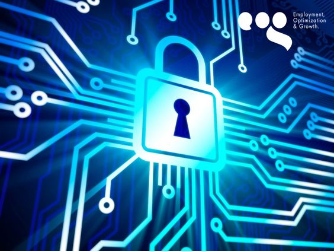

# Seguridad Laboral

  

# Índice
## 1. Evaluación de riesgos
## 2. Formación
## 3. Ergonomía
## 4. Procedimiento de emergencia
## 5. Inspecciones regulares

# Evalucación de riesgos

En cada empresa hay que evaluar los riesgos laborales que tiene, hay que determinar, analizar, valorar  y analizar la seguridad informática de la empresa. Esta última es muy importante ya que la integridad del contenido y de los datos es el talon de Aquiles de cualquier empresa/individuo de esta era informática. Toda empresa contemporánea debería tener un departamento de informática o en su defecto hacer uso de servcicios informáticos para poder proteger sus datos.

  

# Formación

Realizar una formación de introducción a la informática a los empleados conllevará a tener una mejor seguridad en el trabajo, ya sea por medios como correos electrónicos sospechosos, archivos maliciosos o cualquier mensaje/información procedente de un emisor desconocido. Si los trabajadores con capaces de detectar estos tipos de situaciones la seguridad de la empresa mejorará considerablemente. 

  

# Ergonomía

La ergonomía laboral es la disciplina que se encarga de que el espacio laboral, las herramientas y las tareas de trabajo coincidan con las características fisiológicas, anatómicas y psicológicas del empleado para salvaguardar su bienestar y su salud mental y física.

En el documento técnico "Orientaciones para la gestión de los aspectos ergonómicos y psicosociales en situación de teletrabajo" del Ministerio de trabajo social y economía social del *Gobierno de España*, el apartado 4 habla de los riesgos físicos y mentales del teletrabajo, en el aspecto físico, el uso de ordenadores de sobremesa como portátiles  pueden dar a la aparición de transtornos musculoesqueléticos causados principalmente por malas posturas y carga estática. Un buen puesto de trabajo como una silla ergonómica, un escritorio a la altura y un buen equipo de pantallas, teclados y demás, evitarian problemas fśicos mencionados anteriormente.

Si hablamos de lo Psicosocial el tiempo de trabajo es el principal factor a tener en cuenta, la conectividad permanente a las TIC, conlleva a tener horarios insusales como puede ser durane la noche o los fines de semanas que provocan una fatiga informática e impedir un descanso adecuado.

  

# Procedimiento de emergencia

Es fundamental elaborar un procedimiento de emergencia en cualquier empresa, si actuamos rápido en caso de una emergencia podremos reducir lo mas mínimo los daños realizados a la empresa. En la informática es muy importante actuar lo más rápido posible, por ejemplo en una ataque DDoS, lo más efectivo en su momento es cerrar lo más rápido posible el servior ya que si dejamos el servidor abierto los costes de ancho de banda se incrementarán exponencialmente. Dicho esto, para realizar un procedimiento de emergencia primero hay que evaluar, analizar y establecer estrategias de recuperación efectivas. 

Una cosa importante es saber a quien recurrir, trata siempre de contar con especialistas profesionales que sepan manejarse en situaciones parecidas a las emergentes.

  

# Inspecciones regulares

Cada cierto tiempo hay que inspeccionar nuestro lugar de trabajo, si estamos trabajando en una oficina, hay que comprobar si las instalaciones están en un buen estado como por ejemplo: la electricidad, la ergonomía, el espacio, la cañeria, etc.
Por otr lado las herramientas, en informática es indispensable tener un equipo en condiciones, que sea efectivo y seguro, ya que mucha información confidencial tanto nuestra como de la empresa estará en nuestros dispositivos, por eso hay que actualizar los equipos al día para seguir con la mejoras de sguridad que nos ofrece nuestros dispositivos. También hay que comprobar cosas como los extintores, salidas de emergencia, ventilaci.on, etc. De esta forma garantizaremos una buena seguridad a la hora de un accidente labral.

# Referencias

### Evaluación de riesgos
[Power Data](https://blog.powerdata.es/el-valor-de-la-gestion-de-datos/bid/234639/C-mo-evaluar-el-riesgo-de-la-seguridad-inform-tica-de-una-empresa)

### Formación
[Linkedin](https://es.linkedin.com/pulse/la-importancia-de-educaci%C3%B3n-y-concienciaci%C3%B3n-los-empleados-en)

### Ergonomía
[Ministerio de trabajo y economía social](https://www.insst.es/materias/riesgos/riesgos-ergonomicos)

### Procedimiento de emergencia
[Cibernos](https://www.grupocibernos.com/blog/recuperacion-ante-desastres-informaticos#:~:text=A%20continuaci%C3%B3n%2C%20te%20explicamos%20los%20pasos%20para%20crear,procedimiento.%20...%205%20Probar%2C%20revisar%20y%20mantener.%20)

### Inspecciones regulares
[TüvRheiland](https://www.tuv.com/spain/es/pruebas-de-aceptaci%C3%B3n-inspecciones-iniciales-y-peri%C3%B3dicas.html)
[idearius](https://www.bing.com/search?q=de+que+sirve+las+actualizaciones+de+los+sitemas+operativos&cvid=19b9882eeb6548c69f3d4edd59230d98&gs_lcrp=EgZjaHJvbWUyBggAEEUYOdIBCTEyNTY3ajBqOagCALACAA&FORM=ANAB01&PC=U531)

# Autores

Alejandro Benítez Quidato 

Errabab Salem Ahriem

# Licencia

 
This work is licensed under <a href="http://creativecommons.org/licenses/by-nc/4.0/?ref=chooser-v1" target="_blank" rel="license noopener noreferrer" style="display:inline-block;">CC BY-NC 4.0</a>
 

